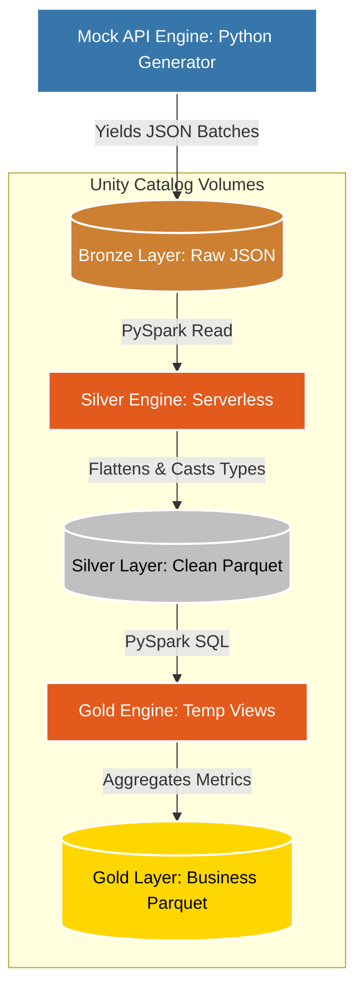

# 🚀 Databricks-Native E-Commerce Data Pipeline (Medallion Architecture)


## 📌 Project Overview
A production-grade, end-to-end Data Engineering pipeline **architected and executed 100% natively within Databricks**. 

This project bypasses traditional UI-based ETL tools, utilizing pure Python and PySpark to ingest, flatten, and aggregate high-volume e-commerce clickstream data. It strictly adheres to the **Medallion Architecture** (Bronze ➔ Silver ➔ Gold) and leverages **Databricks Unity Catalog Volumes** for secure, permanent cloud storage.

---

## 🧠 Design Philosophy: Why a Custom Mock API?
Most data engineering portfolios rely on static CSV files downloaded from external sites. This project takes a completely different approach by engineering a **Custom Python Data Generator** to act as the source. 

Why? Because real-world Data Engineering is about managing constraints, chaos, and scale. 

* **Simulating Memory Constraints (OOM Prevention):** Standard data generation scripts load everything into memory and crash at scale. This generator utilizes Python iterators (`yield`) to simulate API pagination, allowing the system to generate and write millions of records while only ever holding a small batch (e.g., 1,000 records) in memory at a time.
* **Architectural Chaos (Nested JSON):** Real web-log APIs do not return flat tables; they return heavily nested, unpredictable JSON strings. Using Python's `random` module, this script dynamically generates chaotic nested structs (e.g., deeply nested `user_data` and `transaction` blocks) to rigorously test the pipeline's PySpark flattening logic.
* **Simulating Incremental Arrival:** The script stamps each batch with a Unix timestamp and writes it as an independent JSON-Lines file, perfectly simulating how external services like AWS Kinesis or Kafka drop continuous, incremental data batches into a Bronze data lake.

---

## 🏗️ Architecture & Data Flow



* **Ingestion (Mock API):** A custom Python engine yields nested JSON web-log data directly into Unity Catalog Volumes, bypassing cluster memory limits and simulating real-world API pagination.
* **🥉 Bronze Layer:** Raw JSON-Lines data is incrementally persisted exactly as it arrives, creating an immutable historical record.
* **🥈 Silver Layer:** PySpark dynamically flattens complex nested structs (`.*`), enforces strict schema typing (e.g., Timestamps), drops duplicate events, and rewrites the data into highly optimized **Parquet** format.
* **🥇 Gold Layer:** Clean Parquet data is exposed via temporary views and queried using PySpark SQL to construct analytical tables (e.g., Device Activity, Item Revenue), fully prepped for BI consumption.

---

## 🚀 Technical Highlights

* **100% Code-Driven:** Zero reliance on graphical mapping or UI-based ETL tools. All logic is handled programmatically.
* **Columnar Optimization:** Transitioned raw row-based JSON to columnar Parquet, drastically reducing downstream query scan times and compute costs.
* **Serverless Native:** Designed for and executed entirely on Databricks Serverless Compute.

---

## 📂 Repository Structure

```text
├── Bronze_layer.py    # Generates raw JSON and writes directly to Unity Catalog
├── Silver_layer.py    # PySpark engine to flatten JSON and write optimized Parquet
├── Gold_layer.py      # PySpark SQL engine for final business metric aggregations
└── README.md
```

---

## 🛠️ Execution Guide

1. **Import:** Clone or import these scripts into your Databricks Workspace.
2. **Configure:** Ensure **Unity Catalog** is enabled. Create a Volume path for the project.
3. **Route:** Update the `volume_path` variables within the scripts to match your catalog structure (e.g., `/Volumes/<catalog>/<schema>/<volume>/`).
4. **Run `Bronze_layer.py`:** Manufactures the raw source data into your volume.
5. **Run `Silver_layer.py`:** Parses the JSON and writes clean Parquet to the Silver directory.
6. **Run `Gold_layer.py`:** Generates the final analytical tables.
